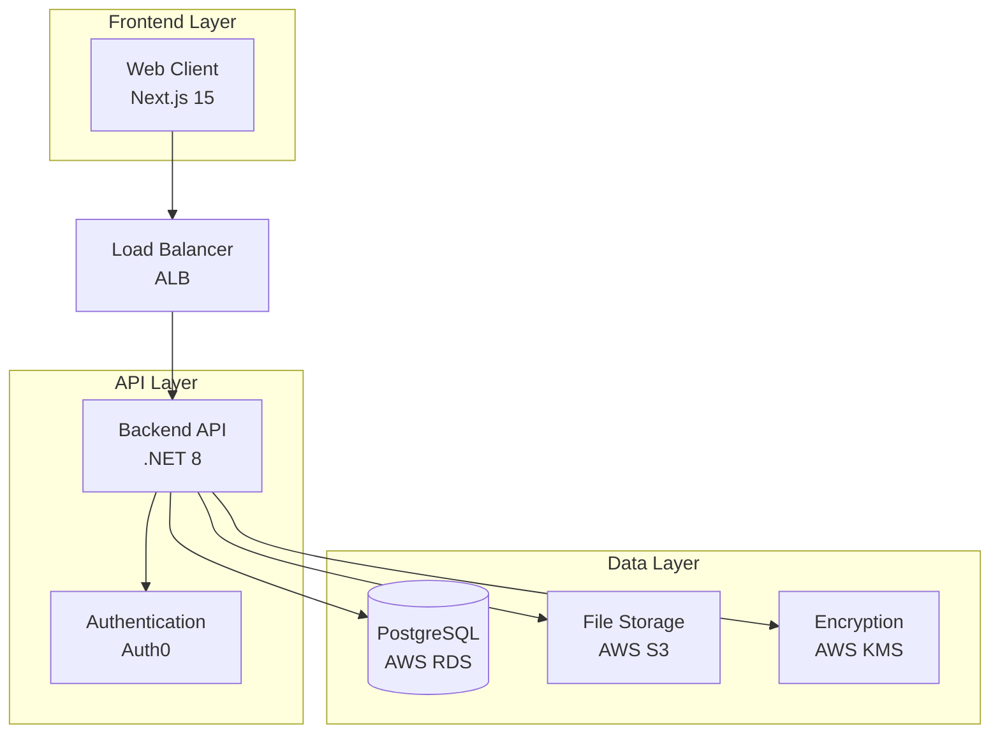

# VaultNotary 🏛️

A comprehensive, secure notary document management system built with modern technologies and enterprise-grade security. VaultNotary provides a complete solution for digital document notarization, customer management, and secure file storage.

[](https://dotnet.microsoft.com/)
[](https://nextjs.org/)
[](https://postgresql.org/)
[](https://aws.amazon.com/)
[](https://docker.com/)

## 🎯 Overview

VaultNotary is a full-stack application designed for notary public offices and legal professionals who need to manage customer information, documents, and digital signatures securely. The system provides end-to-end encryption, audit trails, and compliance with legal document management standards.

### ✨ Key Features

- **Digital Notarization** - Complete digital notary workflow
- **Customer Management** - Comprehensive customer database with ID validation
- **Document Management** - Secure document storage and organization
- **Enterprise Security** - End-to-end encryption with AWS KMS
- **Responsive Design** - Mobile-first responsive interface
- **Multi-language Support** - Vietnamese and English localization
- **Real-time Updates** - Live document status updates
- **Analytics Dashboard** - Comprehensive reporting and insights

## 🏗️ System Architecture



### Technology Stack

#### Backend (.NET 8)
- **Framework**: ASP.NET Core Web API
- **Architecture**: Clean Architecture with DDD principles
- **Database**: PostgreSQL with Entity Framework Core
- **Authentication**: Auth0 JWT tokens
- **Cloud Services**: AWS S3, KMS, RDS
- **Logging**: Serilog with structured logging
- **Testing**: xUnit, NSubstitute, FluentAssertions

#### Frontend (Next.js 15)
- **Framework**: Next.js with App Router
- **Language**: TypeScript
- **Styling**: Tailwind CSS + shadcn/ui
- **State Management**: Zustand + React Query
- **Forms**: React Hook Form + Zod validation
- **Authentication**: Auth0 Next.js SDK
- **Testing**: Vitest + Playwright

#### Infrastructure
- **Containerization**: Docker + Docker Compose
- **Cloud Platform**: AWS (ECS, RDS, S3, KMS, ALB)
- **CI/CD**: GitHub Actions
- **Monitoring**: AWS CloudWatch
- **SSL/TLS**: AWS Certificate Manager

## 🚀 Quick Start

### Prerequisites

- [Docker](https://docs.docker.com/get-docker/) and Docker Compose
- [Node.js 18+](https://nodejs.org/) (for local development)
- [.NET 8 SDK](https://dotnet.microsoft.com/download) (for local development)
- AWS Account with S3, KMS, and RDS access
- Auth0 account for authentication

### 🐳 Docker Setup (Recommended)

1. **Clone the repository:**
   ```bash
   git clone <your-repo-url>
   cd vaultNotary
   ```

2. **Configure environment:**
   ```bash
   cp .env.example .env
   # Edit .env with your configuration
   ```

3. **Start the application:**
   ```bash
   docker-compose up -d
   ```

4. **Access the application:**
   - Frontend: http://localhost:3000
   - Backend API: http://localhost:5000
   - API Documentation: http://localhost:5000/swagger

### 🛠️ Local Development Setup

#### Backend Setup
```bash
cd backend
dotnet restore
cp .env.example .env
# Configure your .env file
dotnet ef database update --project src/VaultNotary.Infrastructure --startup-project src/VaultNotary.Web
dotnet run --project src/VaultNotary.Web
```

#### Frontend Setup
```bash
cd frontend/project
npm install
cp .env.local.example .env.local
# Configure your .env.local file
npm run dev
```

## 📁 Project Structure

```
vaultNotary/
├── 📁 backend/                    # .NET 8 Backend API
│   ├── src/
│   │   ├── VaultNotary.Domain/    # Core business logic
│   │   ├── VaultNotary.Application/ # Use cases & services
│   │   ├── VaultNotary.Infrastructure/ # Data & external services
│   │   └── VaultNotary.Web/       # API controllers
│   └── tests/                     # Unit & integration tests
│
├── 📁 frontend/                   # Next.js Frontend
│   └── project/
│       ├── app/                   # Next.js App Router
│       ├── src/
│       │   ├── components/        # Reusable components
│       │   ├── features/          # Feature modules
│       │   ├── hooks/             # Custom hooks
│       │   ├── lib/               # Utilities
│       │   └── types/             # TypeScript types
│       └── public/                # Static assets
│
├── 📁 infrastructure/             # AWS CloudFormation & deployment
├── 📁 docs/                      # Documentation
├── 🐳 docker-compose.yml         # Local development setup
└── 📋 README.md                  # This file
```

## 🔧 Configuration

### Environment Variables

#### Backend Configuration
```env
# Database
ConnectionStrings__DefaultConnection=Host=localhost;Database=vaultnotary;Username=postgres;Password=your_password

# AWS Services
Aws__Region=ap-southeast-1
Aws__S3__BucketName=your-s3-bucket
Aws__Kms__SymmetricKeyId=your-kms-key-id

# Authentication
Auth0__Domain=your-domain.auth0.com
Auth0__Audience=https://your-api-identifier
```

#### Frontend Configuration
```env
# API
NEXT_PUBLIC_API_URL=http://localhost:5000/api

# Authentication
AUTH0_SECRET=your-auth0-secret
AUTH0_BASE_URL=http://localhost:3000
AUTH0_DOMAIN=your-domain.auth0.com
AUTH0_CLIENT_ID=your-client-id
AUTH0_CLIENT_SECRET=your-client-secret
```

## 🔐 Security Features

### Data Protection
- **End-to-End Encryption**: All files encrypted using AWS KMS
- **At-Rest Encryption**: Database and S3 storage encrypted
- **In-Transit Encryption**: HTTPS/TLS for all communications
- **Hash Verification**: SHA-256 integrity checks for all files

### Authentication & Authorization
- **Multi-Factor Authentication**: Auth0 MFA support
- **Role-Based Access Control**: Granular permission system
- **JWT Tokens**: Secure stateless authentication
- **Session Management**: Configurable session policies

### Compliance & Auditing
- **Audit Trails**: Complete action logging
- **Digital Signatures**: KMS-based document signing
- **Data Retention**: Configurable retention policies
- **GDPR Compliance**: Data privacy and user rights

## 📚 API Documentation

### Core Endpoints

#### Customer Management
```http
GET    /api/customers              # List customers (paginated)
POST   /api/customers              # Create customer
GET    /api/customers/{id}         # Get customer details
PUT    /api/customers/{id}         # Update customer
DELETE /api/customers/{id}         # Delete customer
POST   /api/customers/search       # Advanced search
```

#### Document Management
```http
GET    /api/documents              # List documents
POST   /api/documents              # Create document
GET    /api/documents/{id}         # Get document
PUT    /api/documents/{id}         # Update document
DELETE /api/documents/{id}         # Delete document
```

#### File Operations
```http
POST   /api/upload                 # Upload file
GET    /api/download/{fileId}      # Download file
POST   /api/upload/presigned-url   # Get presigned URL
```

### Authentication
All endpoints require Bearer token authentication:
```bash
curl -H "Authorization: Bearer <jwt-token>" \
     https://api.yourdomain.com/api/customers
```

## 🧪 Testing

### Backend Tests
```bash
cd backend
# Run all tests
dotnet test

# Run with coverage
dotnet test --collect:"XPlat Code Coverage"

# Run specific test project
dotnet test tests/VaultNotary.UnitTests/
```

### Frontend Tests
```bash
cd frontend/project
# Unit tests
npm run test

# E2E tests
npm run test:e2e

# Watch mode
npm run test:watch
```

### Test Coverage
- Backend: >80% code coverage
- Frontend: >75% component coverage
- Integration tests for all critical paths

## 🚀 Deployment

### AWS ECS Deployment

1. **Build and push images:**
   ```bash
   # Backend
   docker build -t vaultnotary-backend ./backend
   docker tag vaultnotary-backend:latest $ECR_URI/vaultnotary-backend:latest
   docker push $ECR_URI/vaultnotary-backend:latest

   # Frontend
   docker build -t vaultnotary-frontend ./frontend
   docker tag vaultnotary-frontend:latest $ECR_URI/vaultnotary-frontend:latest
   docker push $ECR_URI/vaultnotary-frontend:latest
   ```

2. **Deploy infrastructure:**
   ```bash
   cd infrastructure
   aws cloudformation deploy --template-file vaultnotary-stack.yml \
     --stack-name vaultnotary --capabilities CAPABILITY_IAM
   ```

3. **Update ECS services:**
   ```bash
   aws ecs update-service --cluster vaultnotary-cluster \
     --service vaultnotary-service --force-new-deployment
   ```

### Docker Compose Production
```bash
# Production deployment
docker-compose -f docker-compose.prod.yml up -d
```

## 📊 Monitoring & Observability

### Application Monitoring
- **Health Checks**: Automated health monitoring
- **Metrics**: Custom business metrics
- **Alerting**: CloudWatch alarms and notifications
- **Log Aggregation**: Centralized logging with ELK stack

### Performance Monitoring
- **APM**: Application performance monitoring
- **Database Monitoring**: Query performance and optimization
- **CDN Analytics**: Static asset delivery metrics
- **User Analytics**: User interaction tracking

## 🔄 Development Workflow

### Git Workflow
1. Create feature branch from `main`
2. Develop feature with tests
3. Submit pull request
4. Code review and approval
5. Merge to `main`
6. Automated deployment to staging
7. Manual deployment to production

### Code Quality Gates
- ✅ All tests passing
- ✅ Code coverage thresholds met
- ✅ Security scans passed
- ✅ Performance benchmarks met
- ✅ Code review approved

## 📈 Roadmap

### Phase 1 (Current)
- ✅ Core customer management
- ✅ Document upload and storage
- ✅ Basic security implementation
- ✅ Authentication integration

### Phase 2 (Q3 2025)
- 🔄 Advanced search capabilities
- 🔄 Digital signature workflows
- 🔄 Audit trail implementation
- 🔄 Mobile app development

### Phase 3 (Q4 2025)
- 📅 AI-powered document analysis
- 📅 Advanced analytics and reporting
- 📅 Multi-tenant architecture

### Phase 4 (Q1 2026)
- 📅 API marketplace integration
- 📅 Third-party connector ecosystem
- 📅 Advanced workflow automation
- 📅 Machine learning insights
